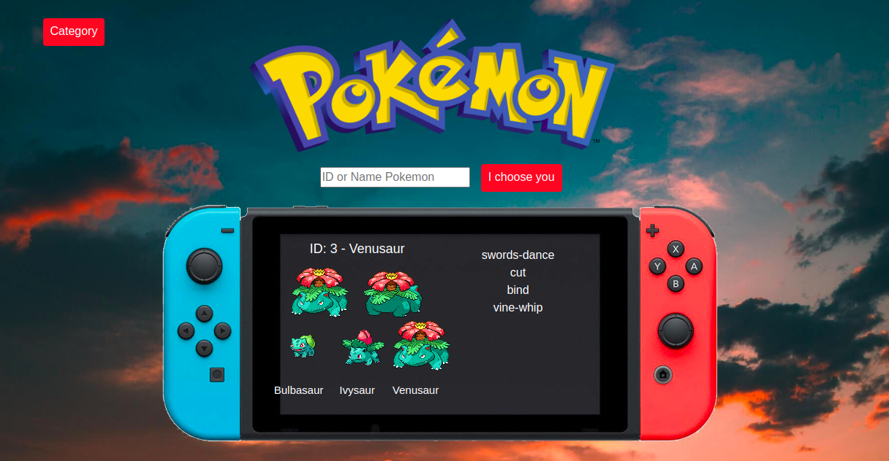
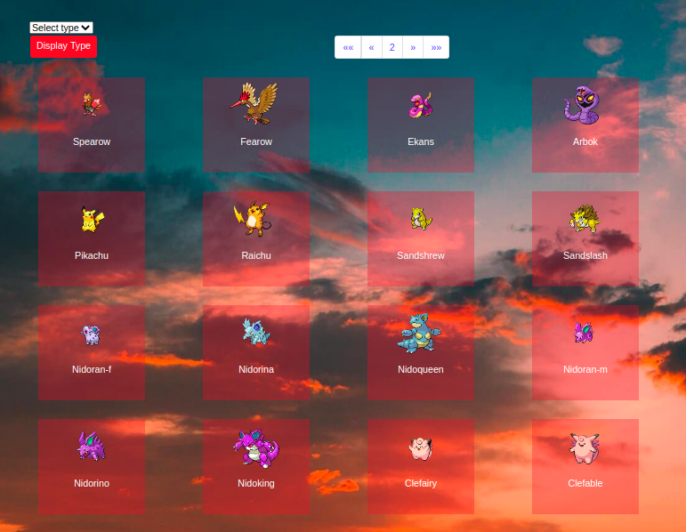

# Pokedex-php
Creating a Pokedex in PHP

## Pokemon challenge - PHP style

- Repository: `challenge-pokemon-php`
- Type of Challenge: `Learning`
- Duration: `3 days`
- Deployment strategy : `NA`
- Team challenge : `solo`

## Learning objectives
- Starting with PHP
    * to write conditions and loops
    * to access external resources (API)
- To know where to search for PHP documentation
- To find out how much easier it is to learn a second programming language, once you know your first programming language (Javascript).

## The Mission
Remember the Pokemon challenge we did in Javascript?
Re-create this challenge in PHP!

**Basic functionality:**
* You can search a pokémon by name and by ID
* Of this pokémon show:
    * The ID-number
    * An image (sprite)
    * _At least_ 4 "moves"
    * The previous evolution, _only if it exists_, along with their name and image.
    

**Extra:**
* Use of a pagination design pattern. Make a "category" page where you show 20 pokemon at the time in a grid. Display their picture and name, a make it clickable to go to their overview page.
* At the top and bottom of that "category" page, add a [pagination component](https://getbootstrap.com/docs/4.0/components/pagination/).

